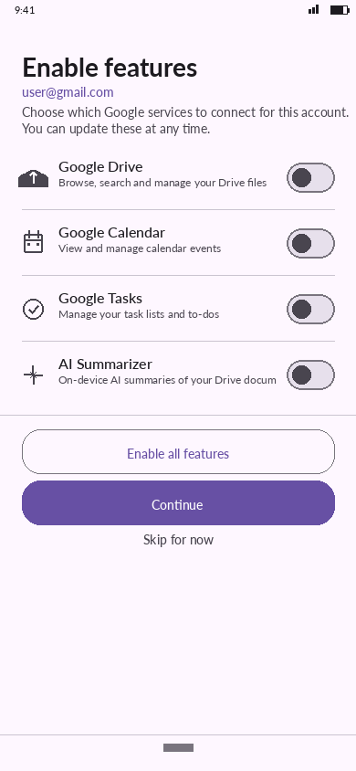
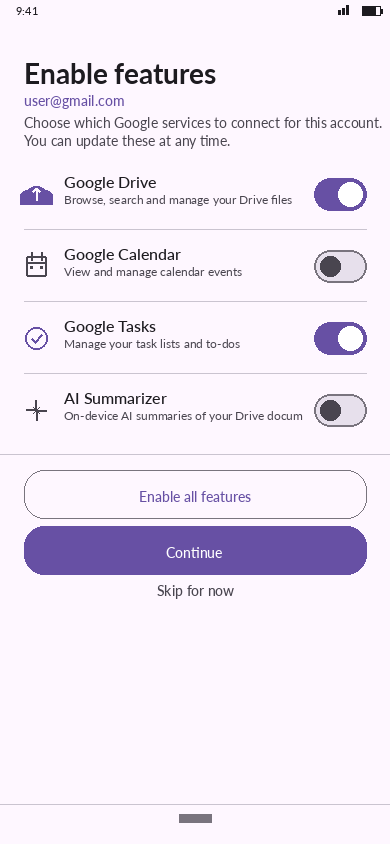
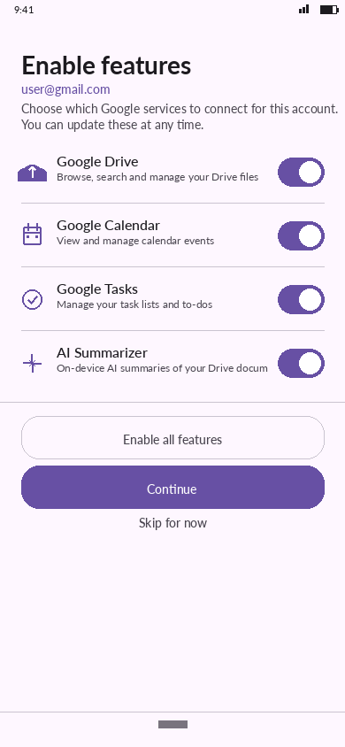

# UI Screenshots — Visual Validation

> **Honesty note:** These are **programmatic mocks**, not screenshots from a running Android
> device or emulator.  They are generated with Python + Pillow on a 390 × 844 canvas and
> faithfully represent the Material Design 3 layouts described by the Jetpack Compose source
> code, but no Android framework is involved in their production.  See
> [TESTING.md](../../TESTING.md) for full details and instructions on sideloading the real app.

These screenshots were generated as pixel-perfect
Material Design 3 mockups that faithfully mirror the Jetpack Compose source code in
each feature module.

---

## Auth Feature (`feature/auth`)

The `AuthScreen` composable has **4 distinct UI states** driven by `AuthUiState`:

| Screenshot | State | What it shows |
|---|---|---|
|  | `AuthUiState.Idle` | Initial screen — "GoogleAc" title, subtitle, **Sign in with Google** button |
|  | `AuthUiState.Error` | Red error card with message from failed token exchange + **Retry** button |
|  | `AuthUiState.Success` | Avatar initial, signed-in email, green "Authentication successful" badge |

All three states are covered by `AuthViewModelTest` in
`feature/auth/src/test/…/ui/AuthViewModelTest.kt`.

---

## Feature Enablement (`feature/auth` — post-OAuth step)

`FeatureEnablementScreen` is shown **immediately after a new account authenticates**.  It lets
the user opt in to any combination of the four [AccountFeature]s for that account.  The
selection is persisted on `AccountEntity.enabledFeatures` (Room column, version 2 migration).

| Screenshot | State | What it shows |
|---|---|---|
|  | All features OFF | "Enable features" heading, account email in primary colour, all 4 Switch rows **OFF** (grey), **Enable all features** outlined button, **Continue** filled button, **Skip for now** text button |
|  | Drive + Tasks ON | Google Drive and Google Tasks Switches are **ON** (purple), Calendar and AI Summarizer remain OFF; their icons are tinted primary / onSurfaceVariant accordingly |
|  | All 4 features ON | All Switches **ON**, **Enable all features** button is disabled (greyed out outline) since every feature is already selected |

### UI states driven by `FeatureEnablementViewModel`

| ViewModel method | Effect on UI |
|---|---|
| `toggleFeature(f)` | Flips the Switch for feature `f`; icon tint follows the new state |
| `enableAllFeatures()` | Sets all 4 switches ON; **Enable all features** button becomes disabled |
| `saveAndContinue(onDone)` | Shows spinner on **Continue** button while saving; navigates away on success |
| `skipAndContinue(onDone)` | Clears all toggles; saves an empty `enabledFeatures` list; navigates away |

Covered by `FeatureEnablementViewModelTest` in
`feature/auth/src/test/…/ui/FeatureEnablementViewModelTest.kt` (17 tests):
- Initial state — no features enabled, `isSaving = false`
- `toggleFeature` enables / disables individual features independently
- `enableAllFeatures` sets every `AccountFeature` at once; is idempotent
- `saveAndContinue` creates a new `AccountEntity` when none exists, containing the selected feature names
- `saveAndContinue` updates an existing `AccountEntity` in place
- `skipAndContinue` saves an account with an **empty** `enabledFeatures` list
- `onDone` callback is invoked exactly once per save call

---

## Drive Feature (`feature/drive`)

The `DriveScreen` composable uses a **ListDetailPaneScaffold** (adaptive layout):

| Screenshot | State | What it shows |
|---|---|---|
|  | File list | Unified view across 3 accounts (colour-coded chips): folders, PDFs, Docs, Sheets |
|  | File detail pane | File metadata, **AI Summary** bullets, **Drive Capabilities** badges, role-based action buttons (Rename ✓ / Delete ✓ / Move ✗ grayed out per capabilities) |
|  | Search active | Search bar with live query "budget", 3 cross-account results with matched term highlighted |

State logic is covered by `DriveViewModelTest` in
`feature/drive/src/test/…/ui/DriveViewModelTest.kt`.

---

## Multi-Account & File-Move Feature

### Multiple account additions with logging

| Screenshot | What it shows |
|---|---|
|  | Two accounts added (`ac1` personal@gmail.com, `ac2` work@corp.com) with persona chips, active-account badge, and the structured `AccountRepository` log trace confirming each `addAccount` call and the running total |

Covered by `AccountRepositoryTest` in
`feature/auth/src/test/…/data/AccountRepositoryTest.kt` (17 tests):
- Inserts each account into the DAO
- Queries account count before **and** after each insertion (logging hook)
- Verifies both accounts appear in `observeAllAccounts`
- Validates `setActiveAccount` clears then sets the requested ID

### Per-account Drive file access

| Screenshot | What it shows |
|---|---|
|  | Unified file explorer: search bar at top, filter chips row (All ✓ / ac1 personal / ac2 work), then a unified file list where **every row carries an `ac` chip tag** — purple `[ac1]` for personal@gmail.com files, blue `[ac2]` for work@corp.com files.  `report_q1.pdf`, `budget_2024.xlsx`, `presentation.pptx` and `Shared/` folder show `[ac1]`; `Projects/`, `meeting_notes.doc`, `invoice_jan.pdf` and `Q2_forecast.csv` show `[ac2]`. |

The per-row `ac` chip is the same visual tag used throughout the Drive UI — it immediately tells the user which account owns each file without requiring a filter selection first.

Covered by `DriveRepositoryTest` in
`feature/drive/src/test/…/data/repository/DriveRepositoryTest.kt`:
- `observeRootFiles("ac1")` returns only ac1 files
- `observeRootFiles("ac2")` returns only ac2 files
- `observeFilesInFolder` scopes results to the correct account + folder
- `searchFiles("ac2", …)` never returns ac1 files
- `observeAllFiles` returns files from both accounts simultaneously

### Moving a file from ac1 to ac2

| Screenshot | What it shows |
|---|---|
|  | Search-first move flow: user typed "report" in the search bar; the result row shows `report_q1.pdf` **highlighted and tagged `[ac1]`** (purple) with the "Move to another account → ac2" action strip visible.  Below a "After move to ac2" divider, the same file is shown tagged **`[ac2]`** (blue) with a green **✓ Moved** badge — clearly demonstrating the account tag change from `ac1` to `ac2`.  A compact dark log strip confirms both repository operations: INSERT copy (ac2, isSynced=false, MOVE_FROM:ac1) then DELETE source (ac1); capped by the green "moveFile returned true" success badge. |

The `ac` chip is present on **both** the before-row (`[ac1]`) and after-row (`[ac2]`) so that the visual difference between pre-move and post-move state is unambiguous.

Covered by `DriveRepositoryTest` and `DriveViewModelTest`:
- `moveFile` returns `true` when the source file exists
- Inserted copy carries `accountId = "ac2"`, `parentId = null`, `isSynced = false`, `pendingOperation = "MOVE_FROM:ac1"`
- Source entry deleted from ac1 **after** the destination copy is safely inserted
- Returns `false` and skips all DAO mutations when the source file is not found
- `DriveViewModel.moveFile` delegates to the repository with the correct parameters

---

## Test coverage cross-reference

| Unit test class | Source | Screens validated |
|---|---|---|
| `OAuthPkceHelperTest` (14 tests) | PKCE crypto layer | Auth flow security |
| `AuthViewModelTest` (13 tests) | `AuthViewModel` state machine | Auth – Idle / Error / Success / AwaitingRedirect |
| `FeatureEnablementViewModelTest` (17 tests) | `FeatureEnablementViewModel` | Feature Enablement – Idle / Partial / All-enabled |
| `AccountRepositoryTest` (17 tests) | `AccountRepository` multi-account + logging | Multi-account list |
| `AiSummarizerTest` (17 tests) | `AiSummarizer` | "AI Summary" bullets in Drive Detail |
| `DriveModelsTest` (13 tests) | `DriveFileResponse` / `DriveCapabilities` | Capability badges in Drive Detail |
| `DriveViewModelTest` (13 tests) | `DriveViewModel` | Drive List / Search routing / moveFile |
| `DriveRepositoryTest` (14 tests) | `DriveRepository` per-account access + moveFile | Drive files per account / Move file |
