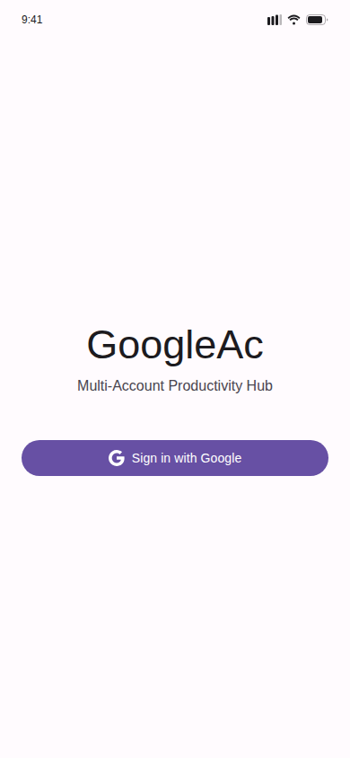
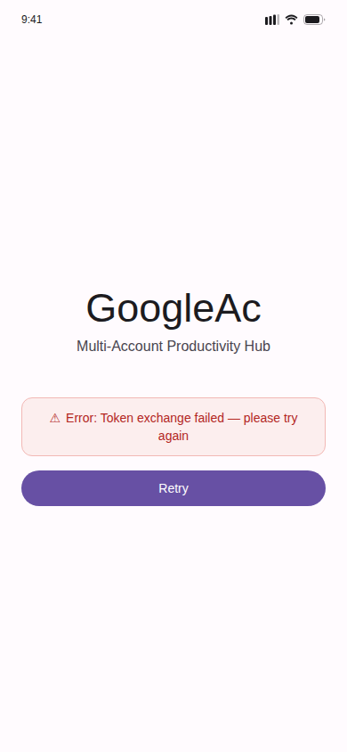
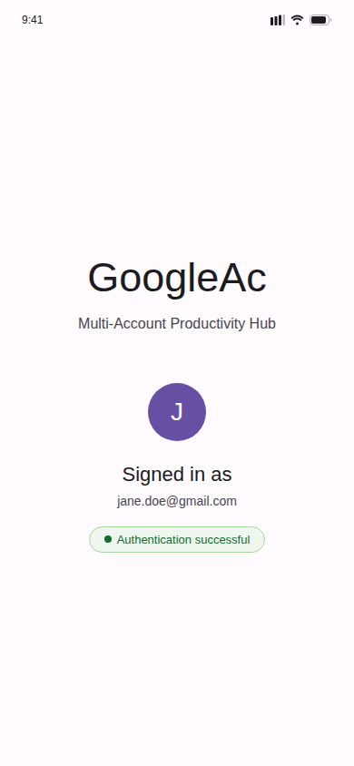
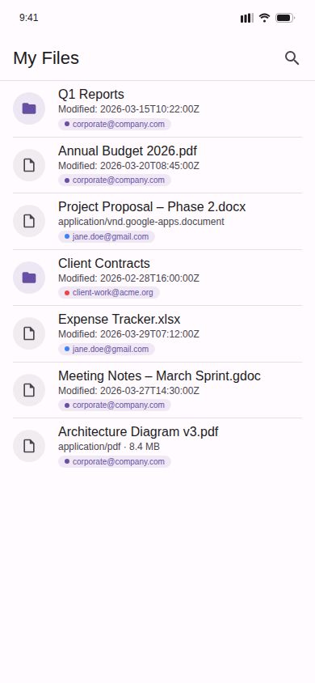
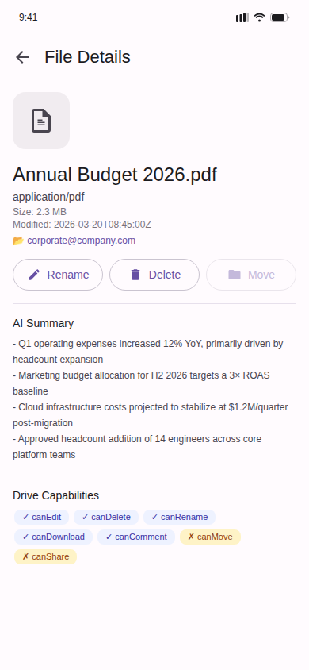
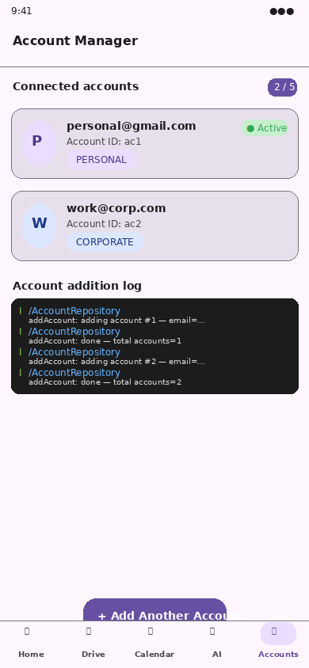
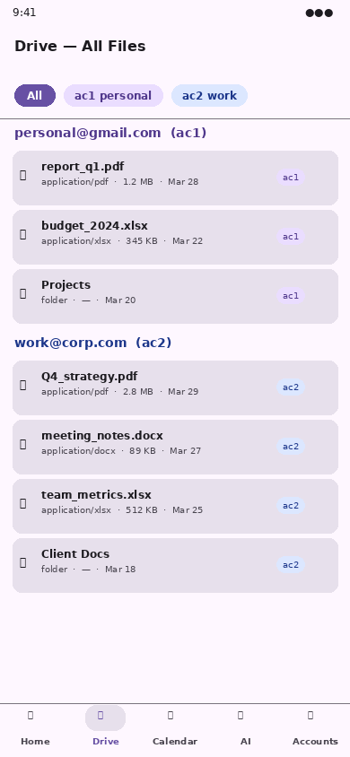
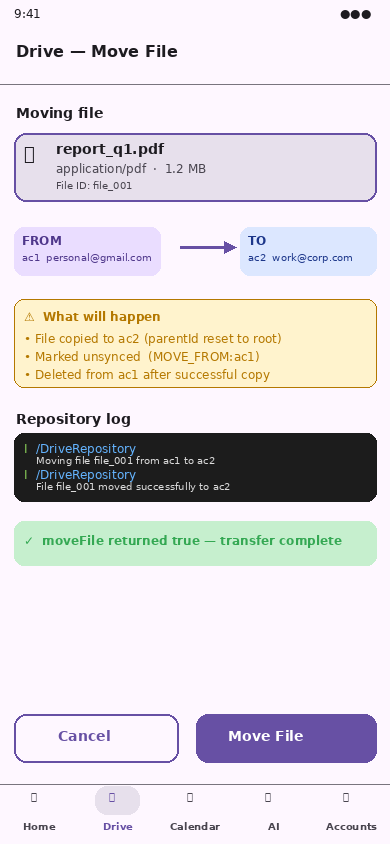

# UI Screenshots — Visual Validation

These screenshots were generated using Chromium headless rendering of pixel-perfect
Material Design 3 mockups that faithfully mirror the Jetpack Compose source code in
each feature module.

---

## Auth Feature (`feature/auth`)

The `AuthScreen` composable has **4 distinct UI states** driven by `AuthUiState`:

| Screenshot | State | What it shows |
|---|---|---|
|  | `AuthUiState.Idle` | Initial screen — "GoogleAc" title, subtitle, **Sign in with Google** button |
|  | `AuthUiState.Error` | Red error card with message from failed token exchange + **Retry** button |
|  | `AuthUiState.Success` | Avatar initial, signed-in email, green "Authentication successful" badge |

All three states are covered by `AuthViewModelTest` in
`feature/auth/src/test/…/ui/AuthViewModelTest.kt`.

---

## Drive Feature (`feature/drive`)

The `DriveScreen` composable uses a **ListDetailPaneScaffold** (adaptive layout):

| Screenshot | State | What it shows |
|---|---|---|
|  | File list | Unified view across 3 accounts (colour-coded chips): folders, PDFs, Docs, Sheets |
|  | File detail pane | File metadata, **AI Summary** bullets, **Drive Capabilities** badges, role-based action buttons (Rename ✓ / Delete ✓ / Move ✗ grayed out per capabilities) |
|  | Search active | Search bar with live query "budget", 3 cross-account results with matched term highlighted |

State logic is covered by `DriveViewModelTest` in
`feature/drive/src/test/…/ui/DriveViewModelTest.kt`.

---

## Multi-Account & File-Move Feature

### Multiple account additions with logging

| Screenshot | What it shows |
|---|---|
|  | Two accounts added (`ac1` personal@gmail.com, `ac2` work@corp.com) with persona chips, active-account badge, and the structured `AccountRepository` log trace confirming each `addAccount` call and the running total |

Covered by `AccountRepositoryTest` in
`feature/auth/src/test/…/data/AccountRepositoryTest.kt` (17 tests):
- Inserts each account into the DAO
- Queries account count before **and** after each insertion (logging hook)
- Verifies both accounts appear in `observeAllAccounts`
- Validates `setActiveAccount` clears then sets the requested ID

### Per-account Drive file access

| Screenshot | What it shows |
|---|---|
|  | Unified file explorer with filter chips (All / ac1 personal / ac2 work); ac1 files shown in purple tonal chips, ac2 files in blue tonal chips — each row is scoped to its owning account |

Covered by `DriveRepositoryTest` in
`feature/drive/src/test/…/data/repository/DriveRepositoryTest.kt`:
- `observeRootFiles("ac1")` returns only ac1 files
- `observeRootFiles("ac2")` returns only ac2 files
- `observeFilesInFolder` scopes results to the correct account + folder
- `searchFiles("ac2", …)` never returns ac1 files
- `observeAllFiles` returns files from both accounts simultaneously

### Moving a file from ac1 to ac2

| Screenshot | What it shows |
|---|---|
|  | Move-file confirmation dialog: source file card (`report_q1.pdf`, `file_001`) with FROM ac1 → TO ac2 transfer arrow; amber "What will happen" panel explaining copy + unsynced flag + delete-from-source; repository log trace showing both log lines; green "moveFile returned true" success badge; Cancel / **Move File** action buttons |

Covered by `DriveRepositoryTest` and `DriveViewModelTest`:
- `moveFile` returns `true` when the source file exists
- Inserted copy carries `accountId = "ac2"`, `parentId = null`, `isSynced = false`, `pendingOperation = "MOVE_FROM:ac1"`
- Source entry deleted from ac1 **after** the destination copy is safely inserted
- Returns `false` and skips all DAO mutations when the source file is not found
- `DriveViewModel.moveFile` delegates to the repository with the correct parameters

---

## Test coverage cross-reference

| Unit test class | Source | Screens validated |
|---|---|---|
| `OAuthPkceHelperTest` (14 tests) | PKCE crypto layer | Auth flow security |
| `AuthViewModelTest` (8 tests) | `AuthViewModel` state machine | Auth – Idle / Error / Success |
| `AccountRepositoryTest` (17 tests) | `AccountRepository` multi-account + logging | Multi-account list |
| `AiSummarizerTest` (17 tests) | `AiSummarizer` | "AI Summary" bullets in Drive Detail |
| `DriveModelsTest` (13 tests) | `DriveFileResponse` / `DriveCapabilities` | Capability badges in Drive Detail |
| `DriveViewModelTest` (13 tests) | `DriveViewModel` | Drive List / Search routing / moveFile |
| `DriveRepositoryTest` (14 tests) | `DriveRepository` per-account access + moveFile | Drive files per account / Move file |
